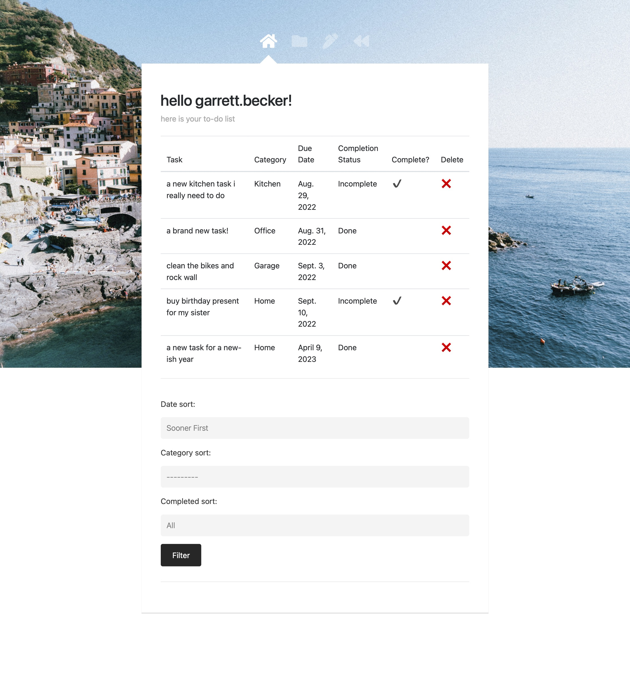

# TaskManager Web App - Django

Log into your account and manage your to-do list with this handy web app! See the links below for the Udemy course I went through where I built this project.

### Project Type

Web Development

### Demo View

### Links

- [Live Demo](https://082-task-manager-web-app-django-gdbecker.replit.app/)
- [100 Days of Code: Python Repo](https://github.com/gdbecker/100DaysOfCodePython/tree/main/06%20-%20Professional/Day%20082%20-%20Task%20Manager%20Web%20App%20(Django))

### Tools & Packages

- [Python](https://www.python.org)
- Django
- functools
- gzip
- difflib
- pathlib
- HTML
- CSS
- [VS Code](https://code.visualstudio.com)

### Skills Used

- Django web development framework
- Methods
- Decorators
- For loops
- If statements
- Dictionaries
- Front-end web design
- REST architecture
- Databases
- Authentication

## Author

- Website - [Garrett Becker]()
- Replit - [@gdbecker](https://replit.com/@gdbecker)
- LinkedIn - [Garrett Becker](https://www.linkedin.com/in/garrett-becker-923b4a106/)
